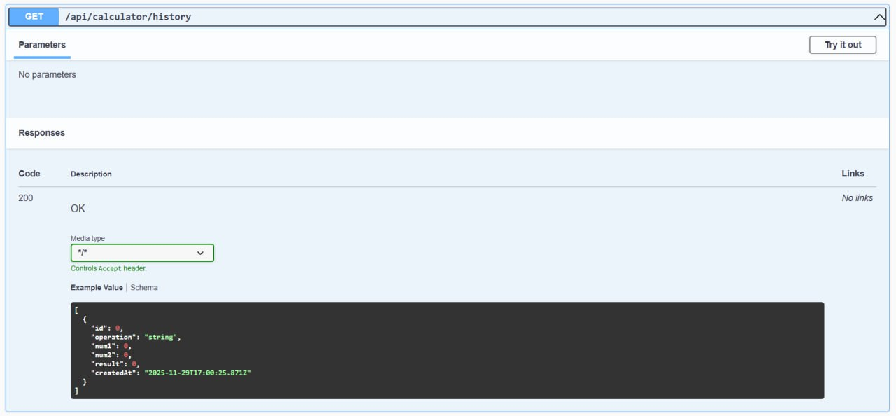
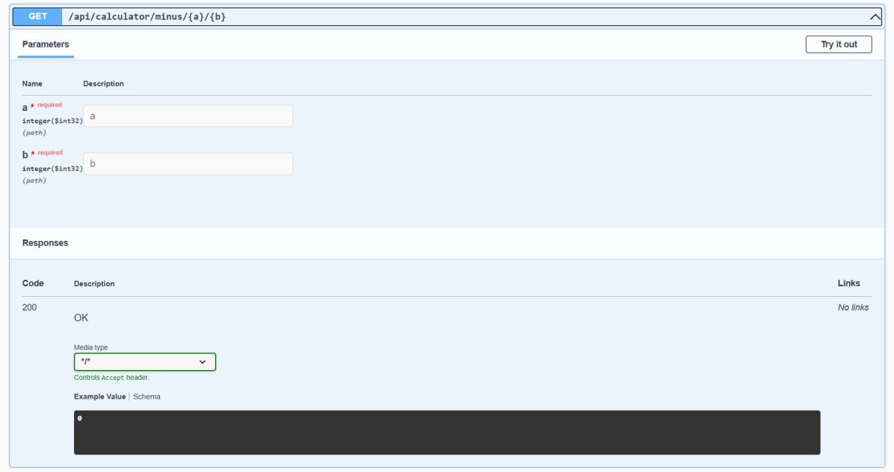
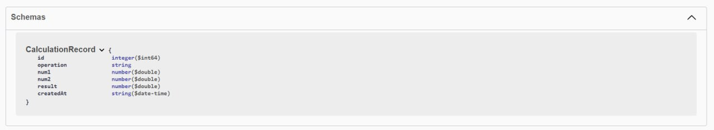
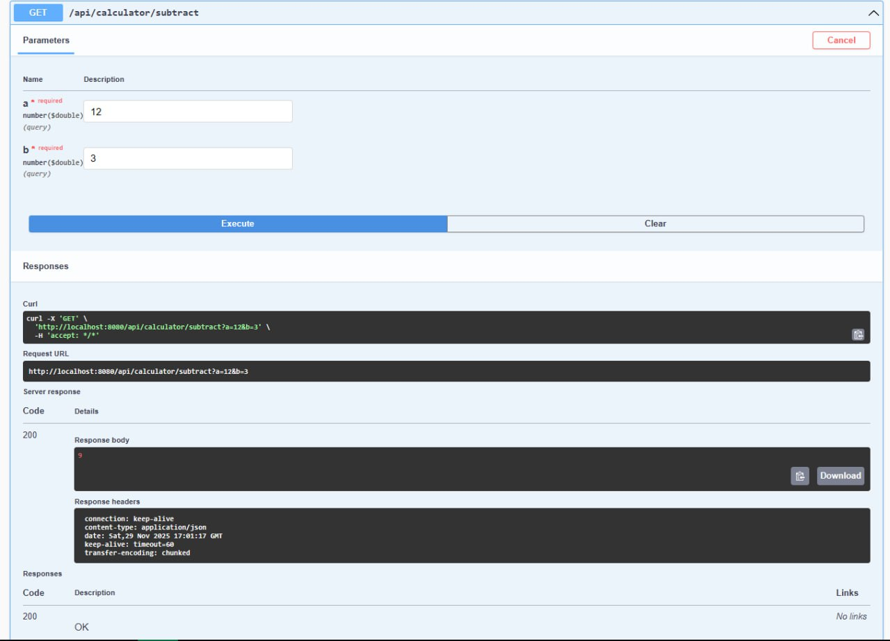
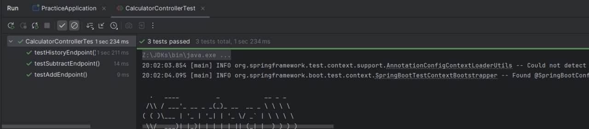

# neoflex_practice
Так как верисия 2.7.11 недоступна, в проекте будет использоваться самая близкая из доступных - 3.4.12

**Вид в Swagger**

**Функция вычитания**

**Просмотр записей бд**

**Функция сложения**

**Схема бд**

**Результат выполнения вычитания**

**езультат выполнения тестов**